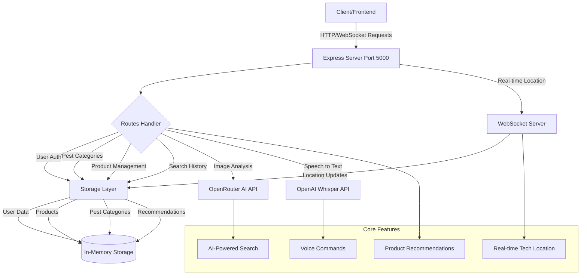

# Backend Architecture Flowchart

## Key Components

1. **Express Server (Port 5000)**
   - Main entry point for HTTP requests
   - Handles API endpoints and static file serving

2. **WebSocket Server**
   - Real-time location tracking for technicians
   - Live updates for nearby tech availability

3. **Storage Layer**
   - Manages user data, products, and pest categories
   - Handles inventory and recommendations
   - In-memory storage for fast access

4. **AI Integration**
   - Image analysis through OpenRouter AI
   - Voice processing via OpenAI Whisper

5. **Core Features**
   - Product recommendations based on pest type
   - Real-time technician location tracking
   - AI-powered pest identification
   - Voice command processing
